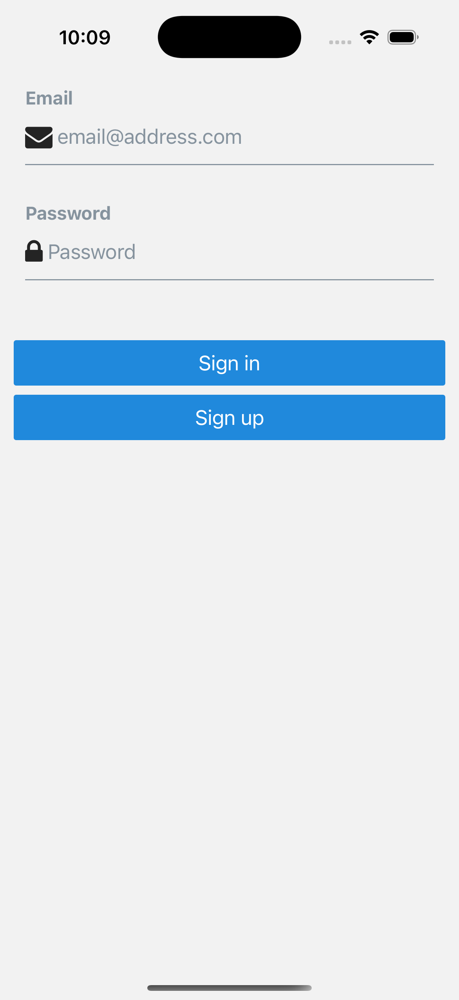

# Expense Tracker (Expo + Supabase)

Simple mobile app to track expenses and visualize monthly spending.

## Overview

This React Native project is a small mobile application with authentication, database integration and data visualization. Built with Expo and Supabase, it lets users sign up, log in, add categorized expenses, and visualize monthly totals through a pie chart.

## Screenshots

|        |  |
| ----------------------------- | ------------------------------- |
|  |        |

## Features

- 🔐 Supabase Auth (email/password) with session persistence
- ➕ Add transactions with amount, category, date, and optional note
- 📊 Monthly spending pie chart with percentage breakdowns
- 🗂️ Category filtering and sorting on the transactions list
- 🗓️ Month selector for browsing historical activity

## Tech Stack

- React Native & Expo
- Expo Router + TypeScript
- Supabase (Auth + Postgres)
- Victory Native (charts)

## Getting Started

1. **Clone**: `git clone https://github.com/efthimiskalpasidis/tracker.git`
2. **Install**: `cd tracker` then `npm install`
3. **Run**: `npx expo start` (Expo Go app or simulator)

## Environment Setup

1. Create a Supabase project at [supabase.com](https://supabase.com/).
2. Add your project URL and anon key to a `.env` file:

```bash
EXPO_PUBLIC_SUPABASE_URL=your-url
EXPO_PUBLIC_SUPABASE_ANON_KEY=your-key
```

3. Set up the database:

- Open the SQL editor in Supabase.
- Run the schema file located at `./schema.sql`, which will:
  - Enable UUID support
  - Create the `transactions` table
  - Enable Row Level Security (RLS)
  - Add policies so users can only access their own transactions
